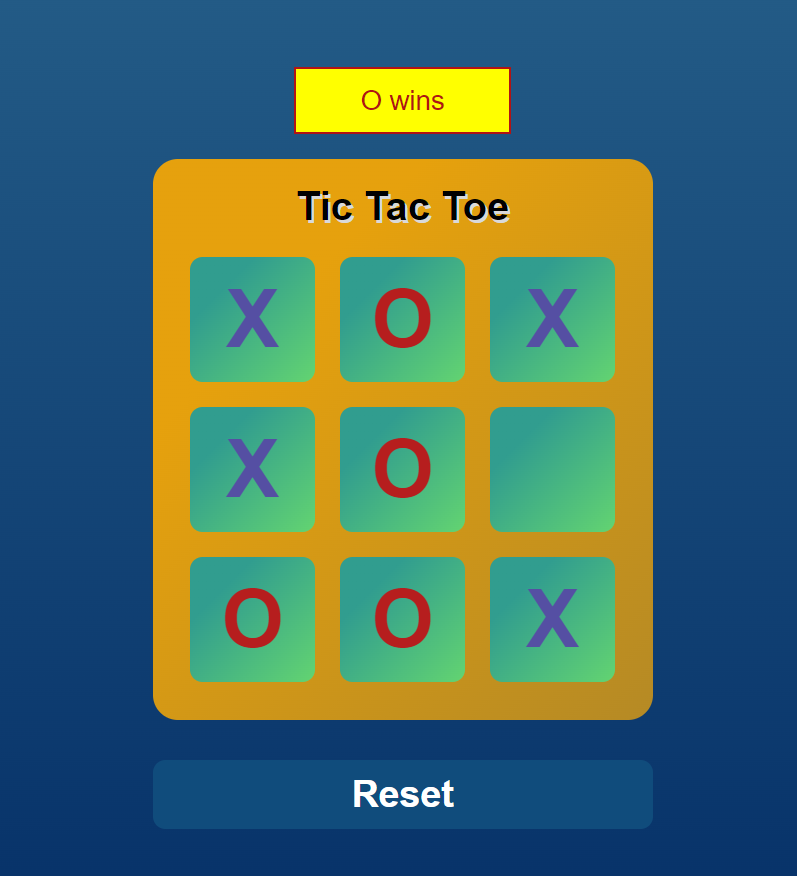

# Tic-Tac-Toe Game

## Description

The Tic-Tac-Toe Game is a web-based application built using HTML, CSS, and JavaScript. It allows users to play the classic game of tic-tac-toe against the computer or another player. The game is fully responsive and can be played on desktop and mobile devices.

## How It Works

1. The game starts with an empty 3x3 grid representing the tic-tac-toe board.
2. Players take turns marking empty cells with their respective symbols, "X" or "O".
3. The objective is to get three of their symbols in a row, either horizontally, vertically, or diagonally, before the opponent.
4. The game continues until one player wins, or it ends in a draw if all cells are filled without a winner.
5. Players can restart the game at any time to play again.

## Live Demo

Check out the live demo of the Tic-Tac-Toe Game [here](https://subham7201.github.io/tic_tac_toe).
